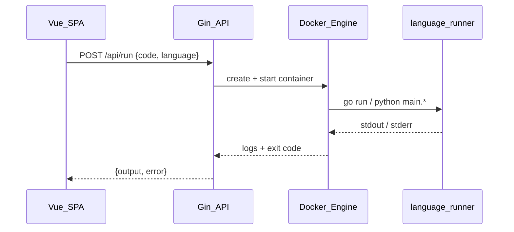

# Code Playground — архитектура выполнения кода

## Обзор

Playground выполняет пользовательский код на сервере в **отдельном Docker-контейнере** на каждый запуск. Поддерживаются **Go** (`.go`) и **Python** (`.py`). Язык определяется расширением файла.



## Компоненты

| Компонент | Файл | Назначение |
|-----------|------|------------|
| Handler | `backend/internal/handlers/run.go` | Валидация запроса, timeout, вызов runner |
| Runner | `backend/internal/runner/docker.go` | Оркестрация Docker-контейнера |
| Languages | `backend/internal/runner/language.go` | Specs для Go и Python |
| Config | `backend/internal/config/config.go` | `GO_RUNNER_IMAGE`, `PYTHON_RUNNER_IMAGE`, `RUN_TIMEOUT` |
| Frontend | `src/utils/language.js` | Определение языка по расширению, шаблоны |

## Языки и образы

| Расширение | API `language` | Docker-образ (default) | Файл | Команда |
|------------|----------------|------------------------|------|---------|
| `.go` | `go` | `golang:1.21-alpine` | `main.go` | `go run /workspace/main.go` |
| `.py` | `python` | `python:3.12-alpine` | `main.py` | `python /workspace/main.py` |

## Изоляция sandbox

На каждый запуск:

- Создаётся контейнер с образом для выбранного языка
- Код копируется в контейнер через Docker API (`CopyToContainer`) — это работает и когда backend сам запущен в Docker
- **Сеть отключена:** `NetworkMode: none`
- **Лимиты ресурсов:** 512 MB RAM, 1 CPU
- **Таймаут:** `RUN_TIMEOUT` (default: 60s), при превышении контейнер принудительно останавливается
- Контейнер удаляется после завершения

Пользовательский код **не имеет** доступа к Docker socket, файловой системе хоста или другим контейнерам.

## Требования к коду пользователя

### Go

Код должен быть полноценной Go-программой:

```go
package main

import "fmt"

func main() {
    fmt.Println("Hello!")
}
```

- Обязательны `package main` и `func main()`
- Auto-wrap фрагментов не поддерживается
- Доступна стандартная библиотека Go
- Нет доступа к сети, файлам вне `/workspace`, CGO и внешним зависимостям (без `go.mod`)

### Python

Скрипт выполняется как есть:

```python
print("Hello!")
```

- Доступна стандартная библиотека Python 3.12
- Нет доступа к сети и файлам вне `/workspace`
- Внешние пакеты (`pip install`) не поддерживаются

## Конфигурация

| Переменная | Default | Описание |
|------------|---------|----------|
| `GO_RUNNER_IMAGE` | `golang:1.21-alpine` | Docker-образ с Go toolchain |
| `PYTHON_RUNNER_IMAGE` | `python:3.12-alpine` | Docker-образ с Python |
| `RUN_TIMEOUT` | `60s` | Максимальное время выполнения |

## Деплой

Backend-сервис в `docker-compose.yml` монтирует:

```yaml
volumes:
  - /var/run/docker.sock:/var/run/docker.sock
```

**Требования к хосту:**
- Docker daemon запущен
- Образы runner предзагружены:

```bash
docker pull golang:1.21-alpine
docker pull python:3.12-alpine
```

## Автосейв и режим наблюдения

| Функция | Описание |
|---------|----------|
| Autosave | Контент сохраняется автоматически через 1.5 с после последнего изменения |
| `autosave_enabled` | Флаг на файле, по умолчанию `true` |
| Отключение autosave | Только admin (галочка в редакторе) |
| Watch mode | Admin открывает файл с `?watch=1` — readonly-редактор, polling каждые 2 с |

Студент не может отключить автосейв. Если admin отключил autosave для файла, студент сохраняет вручную (Ctrl+S); admin в Watch видит изменения после ручного или автоматического сохранения.

## Ограничения

- Первый запуск Go может занять 1–3 секунды из-за компиляции внутри контейнера
- Максимальный размер кода: 100 KB
- Старые `.js` файлы в БД остаются как текст; для выполнения создайте файлы с расширением `.go` или `.py`

## Локальная разработка

1. Запустите Docker Desktop
2. `docker pull golang:1.21-alpine && docker pull python:3.12-alpine`
3. Backend: `cd backend && go run main.go` (нужен доступ к `/var/run/docker.sock`)
4. Frontend: `npm run dev`

Альтернатива: `docker compose up --build` — backend получает socket через compose.
