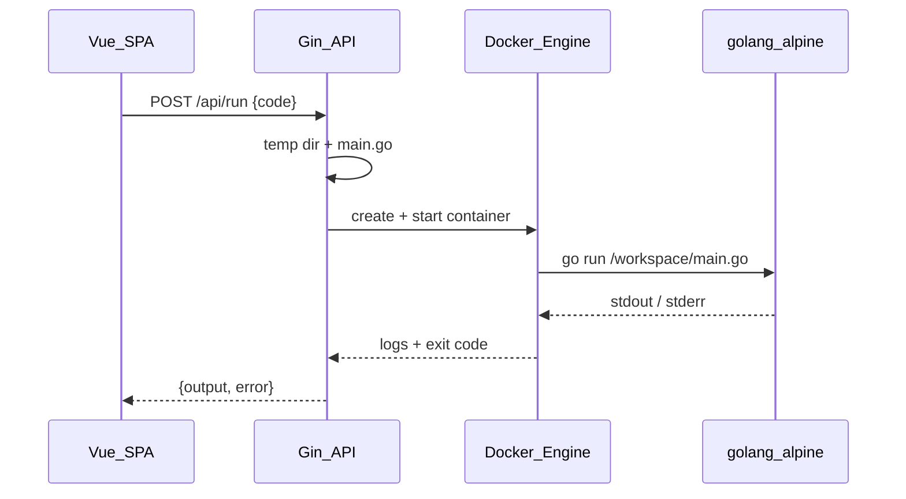

# Go Playground — архитектура выполнения кода

## Обзор

Go Playground выполняет пользовательский код на сервере в **отдельном Docker-контейнере** на каждый запуск. Это заменяет прежний in-process runner на базе goja (JavaScript).



## Компоненты

| Компонент | Файл | Назначение |
|-----------|------|------------|
| Handler | `backend/internal/handlers/run.go` | Валидация запроса, timeout, вызов runner |
| Runner | `backend/internal/runner/docker.go` | Оркестрация Docker-контейнера |
| Config | `backend/internal/config/config.go` | `GO_RUNNER_IMAGE`, `RUN_TIMEOUT` |

## Изоляция sandbox

На каждый запуск:

- Создаётся контейнер с образом `GO_RUNNER_IMAGE` (default: `golang:1.21-alpine`)
- Код копируется в контейнер через Docker API (`CopyToContainer`) — это работает и когда backend сам запущен в Docker
- **Сеть отключена:** `NetworkMode: none`
- **Лимиты ресурсов:** 512 MB RAM, 1 CPU
- **Таймаут:** `RUN_TIMEOUT` (default: 60s), при превышении контейнер принудительно останавливается
- Контейнер удаляется после завершения

Пользовательский код **не имеет** доступа к Docker socket, файловой системе хоста или другим контейнерам.

## Требования к коду пользователя

Код должен быть полноценной Go-программой:

```go
package main

import "fmt"

func main() {
    fmt.Println("Hello!")
}
```

- Обязательны `package main` и `func main()`
- Auto-wrap фрагментов (как `console.log` в JS) не поддерживается
- Доступна стандартная библиотека Go
- Нет доступа к сети, файлам вне `/workspace`, CGO и внешним зависимостям (без `go.mod`)

## Конфигурация

| Переменная | Default | Описание |
|------------|---------|----------|
| `GO_RUNNER_IMAGE` | `golang:1.21-alpine` | Docker-образ с Go toolchain |
| `RUN_TIMEOUT` | `60s` | Максимальное время выполнения |

## Деплой

Backend-сервис в `docker-compose.yml` монтирует:

```yaml
volumes:
  - /var/run/docker.sock:/var/run/docker.sock
```

**Требования к хосту:**
- Docker daemon запущен
- Образ runner предзагружен: `docker pull golang:1.21-alpine`

## Ограничения

- Первый запуск может занять 1–3 секунды из-за компиляции внутри контейнера
- Максимальный размер кода: 100 KB
- Старые `.js` файлы в БД остаются как текст; для Go создайте новые файлы с расширением `.go`

## Локальная разработка

1. Запустите Docker Desktop
2. `docker pull golang:1.21-alpine`
3. Backend: `cd backend && go run main.go` (нужен доступ к `/var/run/docker.sock`)
4. Frontend: `npm run dev`

Альтернатива: `docker compose up --build` — backend получает socket через compose.
